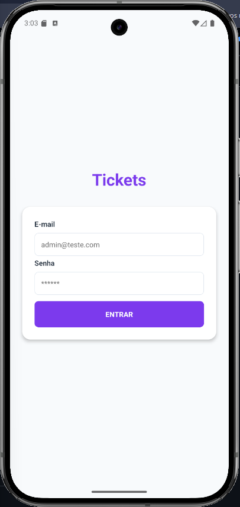
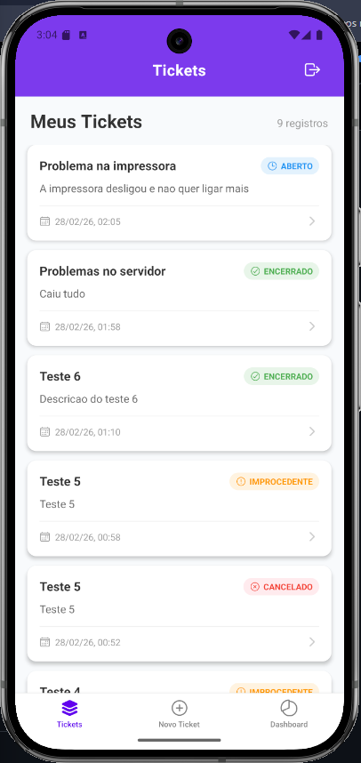
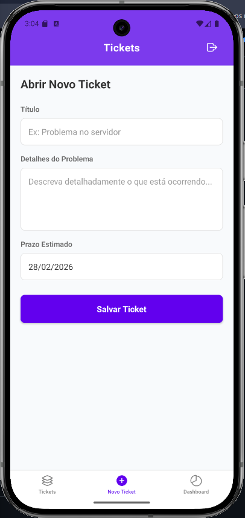
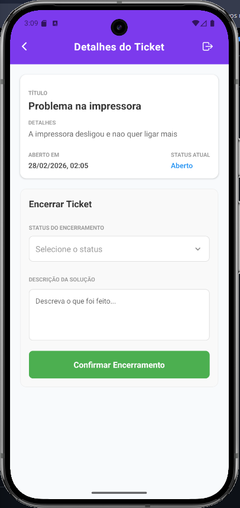
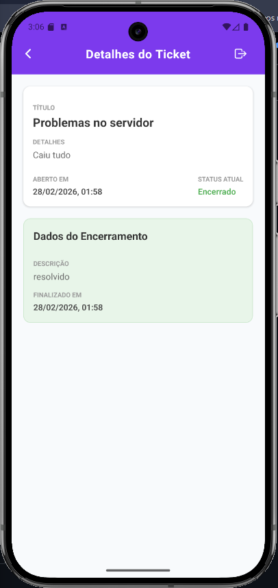
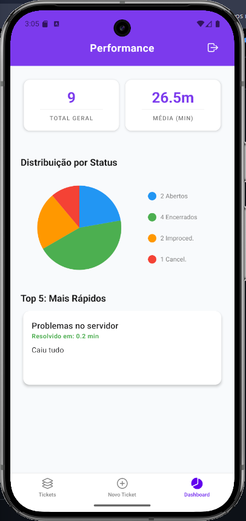

# Tickets — Sistema de Gestão de Chamados

Aplicativo mobile de gestão de tickets (chamados) desenvolvido com **React Native** e **Expo**, como **teste prático para a empresa DavinTI**. Permite login, abertura de tickets, acompanhamento por status, encerramento com descrição e dashboard com métricas e gráficos.

---

## Funcionalidades

- **Autenticação**: login com e-mail e senha; sessão persistida com AsyncStorage.
- **Listagem de tickets**: lista de todos os tickets com título, detalhes, data de abertura e status (Aberto, Encerrado, Improcedente, Cancelado).
- **Novo ticket**: formulário para abrir ticket com título, detalhes do problema e prazo estimado (date picker).
- **Detalhes do ticket**: visualização completa; se aberto, permite encerrar com status (Encerrado / Improcedente / Cancelado) e descrição da solução.
- **Dashboard**: total de tickets, média de tempo de resolução (minutos), gráfico de pizza por status e carrossel com os 5 tickets resolvidos mais rapidamente.

---

## Tecnologias

| Tecnologia | Uso |
|------------|-----|
| **React Native** | UI multiplataforma |
| **Expo (SDK 54)** | Build, tooling e desenvolvimento |
| **TypeScript** | Tipagem estática |
| **React Navigation** | Navegação (Stack + Bottom Tabs) |
| **Zustand** | Estado global (auth + tickets) |
| **AsyncStorage** | Persistência (login e tickets) |
| **React Hook Form** | Formulário de login com validação |
| **React Native Paper** | Componentes e tema (Material Design 3) |
| **react-native-chart-kit** | Gráfico de pizza no Dashboard |
| **react-native-reanimated-carousel** | Carrossel “Top 5” no Dashboard |
| **react-native-toast-message** | Feedback de sucesso/erro |
| **@react-native-community/datetimepicker** | Seletor de data (prazo do ticket) |
| **react-native-element-dropdown** | Dropdown de status no encerramento |

---

## Pré-requisitos

- **Node.js** (recomendado LTS, ex.: 18 ou 20)
- **npm** ou **yarn**
- **Expo Go** no celular (opcional) ou emulador/simulador Android/iOS

---

## Instalação e execução

1. **Clone o repositório** (se ainda não tiver):

   ```bash
   git clone https://github.com/Felipe-Netto/React-Native-Teste-Pratico-DavinTI.git
   cd teste-pratico-davinti
   ```

2. **Instale as dependências**:

   ```bash
   npm install
   ```

3. **Inicie o projeto**:

   ```bash
   npx expo start
   ```

4. **Abra o app**:
   - Escaneie o QR Code com o **Expo Go** (Android/iOS), ou
   - Pressione **a** para Android ou **i** para iOS no terminal (com emulador/simulador aberto), ou
   - Acesse no navegador com **w** (modo web).

---

## Credenciais de login

Para acessar o app após a tela de login:

| Campo   | Valor           |
|--------|------------------|
| E-mail | `admin@teste.com` |
| Senha  | `123456`          |

Validações: e-mail no formato válido; senha obrigatória com mínimo 6 caracteres.

---

## Estrutura do projeto

```
teste-pratico-davinti/
├── App.tsx                 # Entrada: providers (SafeArea, Paper, Navigation, Toast)
├── index.js                # Ponto de entrada Expo
├── app.json                # Configuração Expo (nome, ícones, plugins)
├── package.json
├── tsconfig.json
│
├── src/
│   ├── constants/
│   │   └── theme.ts        # Tema (cores, espaçamentos) baseado em React Native Paper
│   │
│   ├── types/
│   │   ├── Auth.tsx        # AuthStore, Login
│   │   ├── Navigation.tsx  # RootStackParamList
│   │   └── Ticket.tsx      # Ticket, TicketStatus, TicketStore
│   │
│   ├── hooks/
│   │   ├── useAuth.tsx     # Store Zustand de autenticação (persistida)
│   │   └── useTicket.tsx   # Store Zustand de tickets (persistida) + getStatusDetails
│   │
│   ├── router/
│   │   └── AppRouter.tsx   # Stack (Login | Main) + Tab (Home, Novo, Dash) + TicketDetails
│   │
│   ├── screens/
│   │   ├── Login.tsx       # Tela de login (e-mail, senha, validação)
│   │   ├── Home.tsx        # Lista de tickets (FlatList + TicketItem)
│   │   ├── NewTicket.tsx   # Formulário novo ticket (título, detalhes, prazo)
│   │   ├── TicketDetails.tsx # Detalhes + OpenTicket ou ClosedTicket
│   │   └── Dashboard.tsx   # Métricas, gráfico e carrossel Top 5
│   │
│   ├── components/
│   │   ├── Header.tsx      # Cabeçalho com título, botão voltar e logout
│   │   ├── ScreenView.tsx  # Container de tela (fundo do tema)
│   │   ├── TicketItem.tsx  # Card de ticket na lista (status, data)
│   │   ├── TicketInfoCard.tsx # Card de informações na tela de detalhes
│   │   ├── OpenTicket.tsx  # Formulário encerrar ticket (dropdown status + descrição)
│   │   ├── ClosedTicket.tsx # Exibição dos dados de encerramento
│   │   ├── EmptyList.tsx   # Estado vazio da lista de tickets
│   │   └── MetricsCard.tsx # Card de métrica no Dashboard
│   │
│   └── styles/             # StyleSheet por tela/componente
│       ├── Login.ts
│       ├── Home.ts
│       ├── NewTicket.ts
│       ├── TicketItem.ts
│       ├── TicketDetails.ts
│       ├── Dashboard.ts
│       ├── Header.ts
│       └── MetricsCard.ts
│
└── assets/                 # Ícones e imagens (Expo)
```

---

## Fluxo de navegação

- **Não logado**: apenas a tela **Login**.
- **Logado**:
  - **Bottom Tabs**: **Tickets** (Home), **Novo Ticket**, **Dashboard**.
  - **Home** → toque em um ticket → **Detalhes do Ticket** (stack).
  - **Novo Ticket** → após salvar → navega para **Home**.
  - **Detalhes** → encerrar ticket → volta para a tela anterior.

---

## Modelo de dados (Ticket)

- `id`: string (timestamp na criação)
- `title`: string
- `details`: string
- `openingDate`: Date
- `closingDeadline`: Date
- `status`: `Aberto` | `Encerrado` | `Improcedente` | `Cancelado`
- `closingDescription?`: string (preenchido ao encerrar)
- `closingDate?`: Date (preenchido ao encerrar)

Os tickets e o estado de login são persistidos localmente via **Zustand** + **AsyncStorage** (chaves `ticket-storage` e `auth-storage`).

---

## Prints do app

Alguns registros do app em funcionamento:

| Tela | Descrição |
|------|-----------|
| **Login** | Autenticação com e-mail e senha |
| **Tickets** | Lista de tickets com status e data |
| **Novo Ticket** | Formulário de abertura de chamado |
| **Detalhes** | Informações e encerramento do ticket |
| **Ticket Encerrado** | Informações de encerramento do ticket |
| **Dashboard** | Métricas, gráfico e ranking |

<p align="center">
  
  
  
</p>

<p align="center">
  
  
  
</p>

> **Como adicionar os prints:** salve as capturas de tela na pasta `docs/screenshots/` com os nomes: `login.png`, `home.png`, `novo-ticket.png`, `detalhes.png`, `dashboard.png`. Ajuste os nomes no README se preferir outros arquivos.